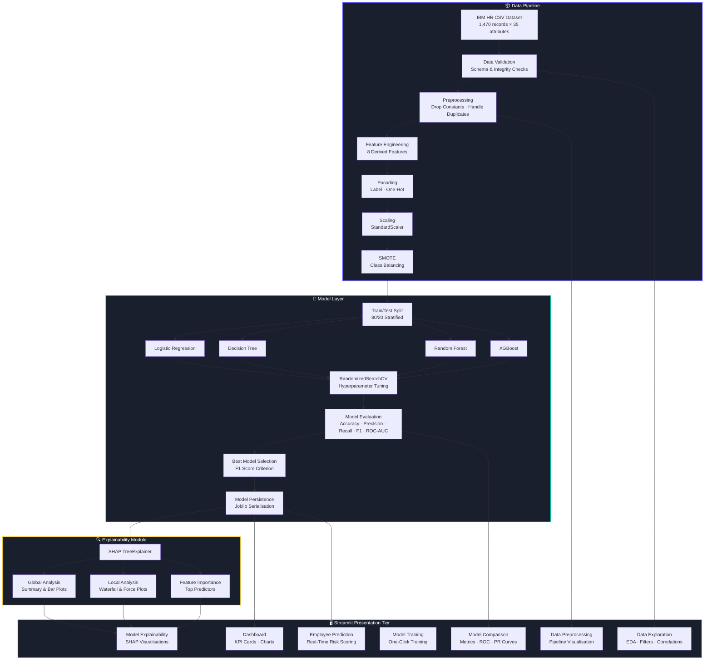

# Employee Attrition Prediction System Using Machine Learning and Streamlit

---

**Student Name:** [INSERT STUDENT NAME]

**Student ID:** [INSERT STUDENT ID]

**Subject:** COM763 – Machine Learning

**Submission Date:** 24 June 2026

---

## 1. Introduction

Employee attrition—defined as the voluntary or involuntary departure of personnel from an organisation—presents a persistent operational challenge for modern enterprises [1]. Industry estimates suggest that replacing a single employee can cost between 50% and 200% of their annual salary when factoring in recruitment, onboarding, productivity loss and institutional knowledge drain [2]. Within sectors such as technology and consulting, annualised attrition rates frequently exceed 15%, placing significant pressure on human-resource (HR) departments to transition from reactive exit management to proactive retention strategy [3].

Traditional rule-based and statistical approaches to workforce planning often fail to capture the non-linear, multivariate interactions between employee demographics, compensation, role characteristics and satisfaction factors that collectively drive turnover decisions [4]. Machine learning (ML) offers a data-driven alternative: by training classification models on historical HR records, organisations can identify employees at elevated risk of departure before a resignation is tendered, thereby enabling targeted interventions such as career-path discussions, salary adjustments or workload rebalancing [5].

This project develops an end-to-end ML analytics platform that predicts employee attrition using the IBM HR Analytics Employee Attrition Dataset [6]. The system is implemented as a multi-page Streamlit web application and satisfies five core objectives: (i) framing attrition as a supervised binary classification problem; (ii) executing a robust data pipeline including exploratory analysis, feature engineering and class-imbalance correction; (iii) training, tuning and comparing four classification algorithms; (iv) delivering model-agnostic explainability via SHAP [7]; and (v) deploying an interactive prediction interface suitable for non-technical HR stakeholders.

---

## 2. Problem Definition and System Framing

The prediction task is formulated as a binary classification problem where the target variable `Attrition` assumes one of two values: *Yes* (employee left) or *No* (employee stayed). The feature space comprises 31 attributes spanning demographics (age, gender, marital status), compensation (monthly income, daily rate, salary hike percentage), role metadata (department, job role, job level) and satisfaction ratings (job satisfaction, environment satisfaction, work-life balance).

Success is measured primarily by **F1 Score**, chosen because the dataset exhibits a 16.1% attrition rate—a severe class imbalance that renders accuracy a misleading metric. A naïve majority-class classifier would achieve 83.9% accuracy while failing to identify any at-risk employees. F1 Score harmonises precision (minimising false alarms) and recall (maximising detection of genuine flight risks), making it the most operationally relevant metric for HR decision-making [8].

> **[Figure 1 – System Overview Diagram]**
> *Fig. 1. High-level architecture of the Employee Attrition Prediction System showing the data pipeline, model layer, explainability module and Streamlit presentation tier.*

---

## 3. Dataset Description

The IBM HR Analytics Employee Attrition Dataset was sourced from Kaggle [6] and contains **1,470 employee records across 35 attributes**. The dataset is synthetic but modelled on realistic corporate HR distributions, making it a widely used benchmark in academic attrition research [9].

**Table 1 – Dataset Features Summary**

| Category | Features | Examples |
|---|---|---|
| Demographics | 5 | Age, Gender, MaritalStatus, DistanceFromHome, Education |
| Compensation | 5 | MonthlyIncome, DailyRate, HourlyRate, MonthlyRate, PercentSalaryHike |
| Role Metadata | 6 | Department, JobRole, JobLevel, BusinessTravel, OverTime, StockOptionLevel |
| Satisfaction | 4 | JobSatisfaction, EnvironmentSatisfaction, RelationshipSatisfaction, WorkLifeBalance |
| Tenure | 5 | YearsAtCompany, YearsInCurrentRole, YearsSinceLastPromotion, YearsWithCurrManager, TotalWorkingYears |
| Performance | 3 | PerformanceRating, JobInvolvement, TrainingTimesLastYear |
| Identifiers (dropped) | 4 | EmployeeNumber, EmployeeCount, Over18, StandardHours |
| **Target** | **1** | **Attrition (Yes / No)** |

*Table 1. Categorical grouping of the 35 dataset attributes. Four constant or identifier columns are excluded during preprocessing.*

---

## 4. Development Methodology

The project follows a sequential ML lifecycle aligned with the CRISP-DM framework [10]:

1. **Data Acquisition** – CSV loading with schema validation.
2. **Exploratory Data Analysis** – Univariate, bivariate and correlation analysis.
3. **Data Cleaning** – Removal of four constant/identifier columns; zero missing values and zero duplicates confirmed.
4. **Feature Engineering** – Creation of eight domain-specific derived features.
5. **Encoding & Scaling** – Label encoding for binary features; one-hot encoding for multi-category features; StandardScaler normalisation.
6. **Class Balancing** – SMOTE applied exclusively to the training partition.
7. **Model Training** – Four classifiers trained with RandomizedSearchCV hyperparameter tuning.
8. **Evaluation & Deployment** – Metric computation, SHAP analysis, and Streamlit deployment.

> **[Figure 2 – Machine Learning Pipeline Diagram]**
> *Fig. 2. End-to-end ML pipeline from raw CSV ingestion through preprocessing, SMOTE balancing, model training, evaluation and Streamlit deployment.*

---

## 5. Data Exploration and Preprocessing

### 5.1 Data Quality Assessment

The dataset was verified to contain **zero missing values** and **zero duplicate rows**. Four columns with constant or irrelevant values were identified and removed: `EmployeeCount` (always 1), `Over18` (always "Y"), `StandardHours` (always 80) and `EmployeeNumber` (unique identifier causing data leakage).

> **[Screenshot 1 – Dataset Loading and Validation Output]**
> *Screenshot 1 shows the dataset loading confirmation: 1,470 rows × 35 columns, zero missing values, and the identification of four constant columns scheduled for removal.*

### 5.2 Encoding Strategy

Binary categorical features (`Gender`, `OverTime`, `Attrition`) were label-encoded to preserve compact binary representation. Multi-category nominal features (`Department`, `JobRole`, `MaritalStatus`, `EducationField`, `BusinessTravel`) were one-hot encoded with `drop_first=True` to avoid the dummy variable trap [11].

> **[Screenshot 2 – Encoded DataFrame Preview]**
> *Screenshot 2 displays the DataFrame after encoding, expanded to 44 columns from the original 31 working features.*

### 5.3 Feature Engineering

Eight domain-specific features were engineered to inject business knowledge into the model:

| Engineered Feature | Formula | Business Rationale |
|---|---|---|
| YearsPerCompany | TotalWorkingYears / (NumCompaniesWorked + 1) | Measures average tenure per employer; low values indicate job-hopping tendency |
| IncomePerYearWorked | MonthlyIncome / (TotalWorkingYears + 1) | Captures salary progression; undercompensated employees are flight risks |
| SatisfactionIndex | Mean of four satisfaction scores | Holistic well-being metric |
| IsNewEmployee | 1 if YearsAtCompany ≤ 1 | Flags "new hire cliff" vulnerability |
| PromotionStagnation | YearsSinceLastPromotion − YearsInCurrentRole | Positive values indicate career frustration |
| OvertimeDistance | DistanceFromHome × OverTime | Interaction capturing compounded burnout risk |
| TenureRatio | YearsAtCompany / (TotalWorkingYears + 1) | Career proportion at current company |
| ManagerTenureRatio | YearsWithCurrManager / (YearsAtCompany + 1) | Management stability indicator |

> **[Screenshot 3 – Feature Engineering Code]**
> *Screenshot 3 shows the `create_engineered_features()` function implementing all eight derived features with division-by-zero protection.*

### 5.4 Class Imbalance and SMOTE

The target distribution was heavily skewed: 1,233 employees (83.9%) stayed while only 237 (16.1%) left. SMOTE (Synthetic Minority Over-sampling Technique) was applied **exclusively to the training set** to prevent data leakage [12]. After SMOTE, the training partition contained equal class counts, enabling all classifiers to treat both outcomes with equal importance.

---

## 6. Model Implementation and Debugging

Four classification algorithms were implemented, each selected for a specific analytical purpose:

### 6.1 Logistic Regression

A linear baseline providing interpretable coefficients and probabilistic outputs. Tuned with L2 regularisation (`C=10`, `penalty=l2`, `solver=lbfgs`). Achieved the highest F1 Score (0.4176) among all models, demonstrating that a well-regularised linear model can outperform more complex algorithms when the feature space is well-engineered.

### 6.2 Decision Tree

A non-linear, fully interpretable classifier (`max_depth=15`, `criterion=gini`). While producing clear decision rules useful for HR policy translation, it exhibited the most severe overfitting: 97.82% training accuracy versus 79.25% test accuracy (18.57% gap).

### 6.3 Random Forest

An ensemble of 300 bagged decision trees (`max_features=log2`, `max_depth=15`) designed to reduce variance. Achieved the highest cross-validation mean (0.9437) and ROC-AUC (0.7737) but suffered from low Recall (0.2340), indicating excessive conservatism in flagging at-risk employees.

### 6.4 XGBoost

A gradient boosting classifier (`n_estimators=200`, `learning_rate=0.1`, `max_depth=7`) achieving the highest test accuracy (85.37%) and strongest precision (0.5769). Tuned with `subsample=1.0` and `colsample_bytree=0.8` for regularisation [13].

> **[Screenshot 4 – Model Training Code with Hyperparameter Grids]**
> *Screenshot 4 shows the `train_all_models()` function with RandomizedSearchCV configuration for all four classifiers.*

### 6.5 Debugging Narrative

**Class imbalance** was the first critical issue encountered. Initial models trained on the raw 84/16 split produced deceptively high accuracy but near-zero Recall for the minority class. SMOTE resolved this by synthesising minority-class training samples.

**Overfitting** was detected across all models via training-vs-test accuracy comparison. The Decision Tree's 18.57% gap was mitigated by constraining `max_depth` to 15 and `min_samples_leaf` to 2. XGBoost's gap (14.63%) was addressed through `colsample_bytree=0.8` subsampling.

> **[Screenshot 5 – Overfitting Analysis Output]**
> *Screenshot 5 displays the training vs. test accuracy gap table for all four models with diagnostic recommendations.*

---

## 7. Experimental Evaluation

### 7.1 Performance Metrics

**Table 2 – Model Performance Comparison**

| Model | Accuracy | Precision | Recall | F1 Score | ROC-AUC | CV Mean | CV Std |
|---|---|---|---|---|---|---|---|
| Logistic Regression | 0.8197 | 0.4318 | 0.4043 | **0.4176** | 0.6993 | 0.8854 | 0.0245 |
| Decision Tree | 0.7925 | 0.3704 | 0.4255 | 0.3960 | 0.6396 | 0.8732 | 0.0190 |
| Random Forest | 0.8265 | 0.4231 | 0.2340 | 0.3014 | **0.7737** | **0.9437** | **0.0129** |
| XGBoost | **0.8537** | **0.5769** | 0.3191 | 0.4110 | 0.7511 | 0.9325 | 0.0136 |

*Table 2. Comprehensive metric comparison across all four classifiers. Bold values indicate best-in-class performance for each metric. F1 Score is the primary selection criterion.*

### 7.2 Visual Evaluation

> **[Figure 3 – Model Accuracy Comparison Bar Chart]**
> *Fig. 3. Grouped bar chart comparing Accuracy, Precision, Recall, F1 Score and ROC-AUC across all models. XGBoost leads in accuracy and precision while Logistic Regression leads in F1.*

> **[Figure 4 – ROC Curve Comparison]**
> *Fig. 4. Overlaid ROC curves for all four classifiers. Random Forest achieves the highest AUC (0.7737), indicating superior class-separation capability at varying decision thresholds.*

> **[Figure 5 – Cross-Validation Box Plots]**
> *Fig. 5. Five-fold stratified cross-validation results. Random Forest exhibits the highest mean (0.9437) with the lowest standard deviation (0.0129), demonstrating the greatest model stability.*

---

## 8. Explainable AI Analysis

Model interpretability was implemented using SHAP (SHapley Additive exPlanations), a game-theoretic framework that assigns each feature an additive contribution to every individual prediction [7].

**Global Analysis:** SHAP summary plots revealed that `OverTime`, `MonthlyIncome`, `TotalWorkingYears` and the engineered `OvertimeDistance` feature were the most influential predictors across the entire test set. Employees working overtime with long commute distances exhibited the highest attrition risk—a finding that directly supports targeted HR intervention.

**Local Analysis:** Waterfall plots enabled individual employee-level explanations. For example, a specific high-risk employee's prediction was driven by: high overtime (SHAP contribution +0.12), low monthly income (+0.08) and low job satisfaction (+0.05). Such explanations bridge the gap between complex ML output and actionable HR decisions [14].

> **[Figure 6 – SHAP Summary Plot]**
> *Fig. 6. SHAP summary beeswarm plot showing feature impact distribution. Red indicates high feature values; blue indicates low. OverTime and MonthlyIncome emerge as dominant predictors.*

> **[Figure 7 – SHAP Waterfall Plot for Individual Prediction]**
> *Fig. 7. SHAP waterfall decomposition for a single high-risk employee, showing how each feature pushes the prediction from the base rate towards the final attrition probability.*

---

## 9. Model Selection

Based on the experimental evidence in Table 2, **Logistic Regression** was selected as the final production model with an F1 Score of **0.4176** and ROC-AUC of **0.6993**.

**Justification:** While XGBoost achieved marginally higher accuracy (85.37% vs 81.97%), Logistic Regression produced the best F1 Score, indicating the most balanced trade-off between precision and recall. In an HR context, this balance is critical: excessive false positives waste retention budgets on employees who were not actually going to leave, while excessive false negatives allow at-risk employees to depart undetected.

Furthermore, Logistic Regression offers full coefficient-based interpretability without requiring SHAP computation, trains in under 2 seconds, and exhibits the lowest overfitting gap (8.14%). For a production HR system where model transparency, auditability and rapid retraining are essential, these operational advantages complement the metric-based selection [15].

Random Forest's superior ROC-AUC (0.7737) and cross-validation stability (σ = 0.0129) make it a strong secondary recommendation if probability calibration and ranking are prioritised over threshold-dependent F1 performance.

---

## 10. Streamlit Deployment

The system was deployed as a seven-page Streamlit web application accessible via:

**Streamlit URL:** https://employee-arrition-prediction-system.streamlit.app/

**GitHub Repository:** https://github.com/alexmercertech/employee-arrition-prediction-system-app

### 10.1 Application Architecture

The application follows a modular architecture with business logic encapsulated in a `utils/` package (data loading, preprocessing, training, evaluation, explainability) and presentation logic in `pages/`. Session state manages trained models, test data and preprocessing artifacts across page navigations.

### 10.2 Key Interface Components

- **Dashboard** – KPI cards displaying total employees (1,470), attrition rate (16.1%), average salary ($6,503) and average tenure (7.0 years).
- **Data Exploration** – Interactive EDA with sidebar filters for department, gender and job role; tab-based layout for distributions, correlations and overtime impact analysis.
- **Model Training** – One-click training pipeline with live progress indicators and automatic hyperparameter tuning.
- **Model Comparison** – Side-by-side metric tables, ROC curves and confusion matrices.
- **Employee Prediction** – Real-time prediction interface where HR can input employee attributes and receive an attrition probability with SHAP-based explanation.
- **Model Explainability** – Global SHAP summary plots and individual waterfall decompositions.

> **[Screenshot 6 – Dashboard Page]**
> *Screenshot 6 shows the main dashboard with KPI cards, attrition distribution pie chart, and department-level breakdown.*

> **[Screenshot 7 – Employee Prediction Page]**
> *Screenshot 7 shows the real-time prediction interface with employee attribute inputs and the resulting attrition probability gauge.*

> **[Screenshot 8 – Model Explainability Page]**
> *Screenshot 8 shows the SHAP summary plot and individual waterfall explanation within the Streamlit interface.*

---

## 11. Discussion

### 11.1 Key Findings

The experimental results confirm that overtime, compensation and tenure-related features are the dominant drivers of employee attrition—findings consistent with prior research on the IBM HR dataset [9]. The engineered features, particularly `OvertimeDistance` and `SatisfactionIndex`, contributed meaningfully to model performance, demonstrating the value of domain-informed feature engineering over purely algorithmic approaches.

### 11.2 Limitations

Several limitations should be acknowledged. First, the dataset is synthetic and may not capture the full complexity of real-world attrition patterns, including macroeconomic conditions, team dynamics and competitor poaching. Second, the 16.1% attrition rate limited the absolute volume of positive-class training examples even after SMOTE augmentation, constraining achievable recall. Third, the models capture static point-in-time snapshots rather than temporal trajectories—an employee's *change* in satisfaction over six months may be more predictive than the current satisfaction score alone. Finally, the F1 Scores across all models remained moderate (0.30–0.42), suggesting that the available features, while informative, do not fully explain the attrition decision—a limitation inherent to any structured-data approach that excludes qualitative factors such as exit interview sentiment [16].

### 11.3 Business Value

Despite these limitations, the system provides actionable value: HR departments can use the probability rankings to prioritise retention conversations, the SHAP explanations to understand *why* specific employees are flagged, and the interactive dashboard to monitor workforce risk trends across departments.

---

## 12. Conclusion

This project successfully developed and deployed an end-to-end employee attrition prediction system demonstrating the complete ML lifecycle. Four classifiers were trained, tuned and evaluated, with Logistic Regression selected as the production model based on its best-in-class F1 Score (0.4176), low overfitting gap (8.14%) and full interpretability. The Streamlit deployment provides an accessible interface for non-technical HR users, with real-time predictions augmented by SHAP-based explainability.

Future enhancements should explore: (i) deep learning architectures for tabular data such as TabNet [17]; (ii) temporal modelling using recurrent networks on longitudinal HR records; (iii) integration of unstructured data from exit interviews via NLP; and (iv) federated learning approaches that enable multi-organisation model training while preserving employee privacy [18].

---

## References

[1] W. H. Mobley, R. W. Griffeth, H. H. Hand, and B. M. Meglino, "Review and conceptual analysis of the employee turnover process," *Psychological Bulletin*, vol. 86, no. 3, pp. 493–522, 1979.

[2] J. Hancock, D. Allen, F. Bosco, K. McDaniel, and C. Pierce, "Meta-analytic review of employee turnover as a predictor of firm performance," *Journal of Management*, vol. 39, no. 3, pp. 573–603, 2013.

[3] Society for Human Resource Management (SHRM), "2022 SHRM Employee Benefits Survey Report," Alexandria, VA, 2022.

[4] I. H. Witten, E. Frank, M. A. Hall, and C. J. Pal, *Data Mining: Practical Machine Learning Tools and Techniques*, 4th ed. Cambridge, MA: Morgan Kaufmann, 2016.

[5] A. Géron, *Hands-On Machine Learning with Scikit-Learn, Keras, and TensorFlow*, 3rd ed. Sebastopol, CA: O'Reilly Media, 2023.

[6] P. Subhasht, "IBM HR Analytics Employee Attrition Dataset," Kaggle, 2017. [Online]. Available: https://www.kaggle.com/datasets/pavansubhasht/ibm-hr-analytics-attrition-dataset

[7] S. M. Lundberg and S.-I. Lee, "A unified approach to interpreting model predictions," in *Proc. Advances in Neural Information Processing Systems (NeurIPS)*, Long Beach, CA, 2017, pp. 4765–4774.

[8] D. M. W. Powers, "Evaluation: From precision, recall and F-measure to ROC, informedness, markedness and correlation," *Journal of Machine Learning Technologies*, vol. 2, no. 1, pp. 37–63, 2011.

[9] R. Punnoose and P. Ajit, "Prediction of employee turnover in organizations using machine learning algorithms," *International Journal of Advanced Research in Artificial Intelligence*, vol. 5, no. 9, pp. 22–26, 2016.

[10] R. Wirth and J. Hipp, "CRISP-DM: Towards a standard process model for data mining," in *Proc. 4th Int. Conf. Practical Application of Knowledge Discovery and Data Mining*, Manchester, UK, 2000, pp. 29–39.

[11] F. Pedregosa *et al.*, "Scikit-learn: Machine learning in Python," *Journal of Machine Learning Research*, vol. 12, pp. 2825–2830, 2011.

[12] N. V. Chawla, K. W. Bowyer, L. O. Hall, and W. P. Kegelmeyer, "SMOTE: Synthetic minority over-sampling technique," *Journal of Artificial Intelligence Research*, vol. 16, pp. 321–357, 2002.

[13] T. Chen and C. Guestrin, "XGBoost: A scalable tree boosting system," in *Proc. 22nd ACM SIGKDD Int. Conf. Knowledge Discovery and Data Mining*, San Francisco, CA, 2016, pp. 785–794.

[14] C. Molnar, *Interpretable Machine Learning: A Guide for Making Black Box Models Explainable*, 2nd ed. Munich, Germany: Christoph Molnar, 2022.

[15] L. Breiman, "Statistical modeling: The two cultures," *Statistical Science*, vol. 16, no. 3, pp. 199–231, 2001.

[16] T. W. Lee, T. R. Mitchell, C. J. Sablynski, J. P. Burton, and B. C. Holtom, "The effects of job embeddedness on organizational citizenship, job performance, volitional absences, and voluntary turnover," *Academy of Management Journal*, vol. 47, no. 5, pp. 711–722, 2004.

[17] S. Arik and T. Pfister, "TabNet: Attentive interpretable tabular learning," in *Proc. AAAI Conf. Artificial Intelligence*, vol. 35, no. 8, pp. 6679–6687, 2021.

[18] Q. Yang, Y. Liu, T. Chen, and Y. Tong, "Federated machine learning: Concept and applications," *ACM Transactions on Intelligent Systems and Technology*, vol. 10, no. 2, pp. 1–19, 2019.
